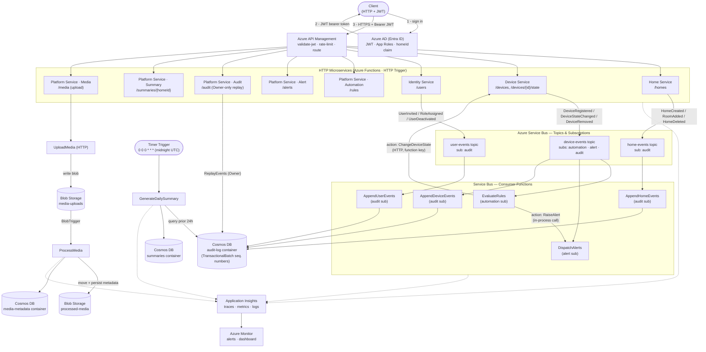
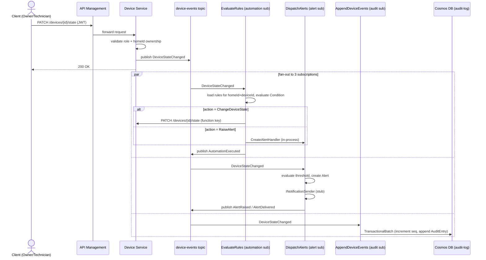
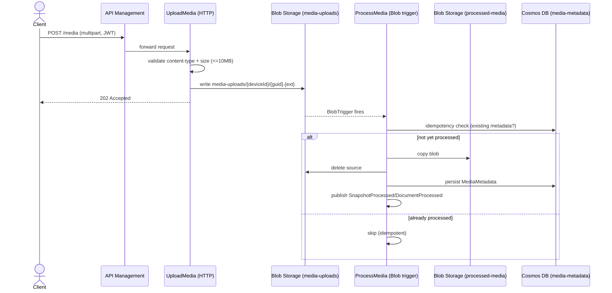
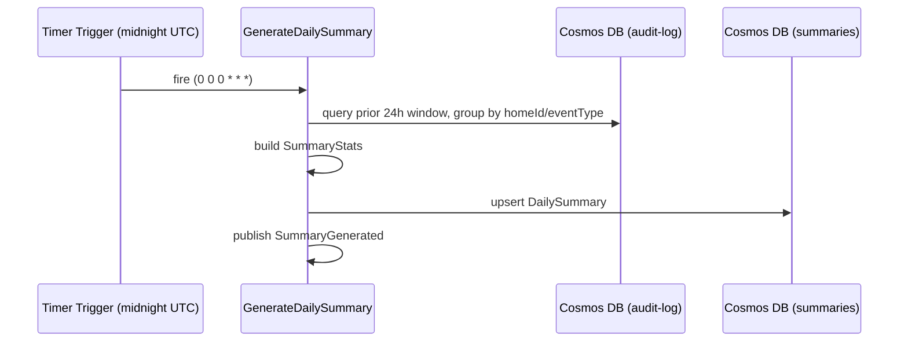

# SmartNest — Application Workflow Diagram

This document visualizes how a request/event actually flows through the SmartNest backend,
based on the implemented services (`home-service`, `device-service`, `identity-service`,
`platform-service`) and the Service Bus / Blob Storage topology in [`infra/`](../infra).

## 1. Overall Request & Event Flow

## 2. Scenario Sequence — Device State Change → Automation → Alert → Audit

The most representative end-to-end workflow: a device state change fans out through the
`device-events` topic to three independent subscribers.

## 3. Scenario Sequence — Media Upload & Processing

## 4. Daily Summary Workflow

## Notes

- All HTTP services enforce role (`SmartNest.Owner` / `SmartNest.Technician` / `SmartNest.Guest`)
  and `homeId` ownership via `AuthorizationGuard`, in addition to APIM's `validate-jwt` policy.
- Automation, Alert, Audit, Summary, and Media are merged into a single Function App
  (`SmartNest.PlatformService`) sharing one hosting plan — see
  [`plan-platformService.prompt.md`](../plan-platformService.prompt.md).
- The `ReplayEvents` endpoint (`/audit`) is Owner-only and reconstructs an aggregate's full
  event stream ordered by `sequenceNumber`.
- Source diagram lives alongside [`smartnest-architecture-diagram.html`](../smartnest-architecture-diagram.html),
  which renders the static topology as hand-built SVG; this file focuses on dynamic
  request/event *workflows* using Mermaid so it renders directly in GitHub/VS Code previews.
